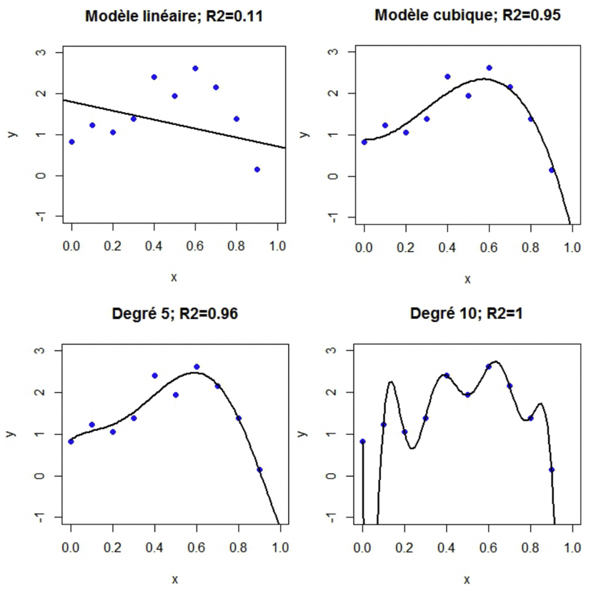

```{r setup, echo=FALSE, cache=FALSE}
library(knitr)
## Global options
options(max.print="75")
knitr::opts_chunk$set(
	echo = TRUE,
	message = FALSE,
	warning = TRUE,
	cache = FALSE,
	comment = NA,
	prompt = FALSE,
	tidy = TRUE
)
opts_knit$set(width=75)
```


*L'objectif de ce TP est d'illustrer les notions abordées dans le chapitre de régression linéaire.*

_______________________________________________________________________________

Les librairies `R` nécessaires pour ce TP sont les suivantes :

```{r,echo=T, error=F, warning=F}
library(ellipse)
library(leaps)
library(MASS)
library(corrplot)
library(glmnet)
library(plotly)
library(ggplot2)     # A mettre en commentaire si non utilisation des graphes ggplot
library(gridExtra)   # A mettre en commentaire si non utilisation des graphes ggplot
library(ggfortify)   # A mettre en commentaire si non utilisation des graphes ggplot
library(ggcorrplot)  # A mettre en commentaire si non utilisation des graphes ggplot
```

_______________________________________________________________________________

# Introduction

La pollution de l'air constitue actuellement une des préoccupations majeures de santé publique. 
De nombreuses études épidémiologiques ont permis de mettre en évidence l'influence sur la santé de certains composés chimiques comme le dioxyde souffre (SO$_2$), le dioxyde d'azote (NO $_2$), l'ozone (O$_3$) ou des particules en suspension. 

Des associations de surveillance de la qualité de l'air (Air Breizh en Bretagne depuis 1994) existent sur tout le territoire métropolitain et mesurent la concentration des polluants. Elles enregistrent également les conditions météorologiques comme la température, la nébulosité, le vent, les chutes de pluie en relation avec les services de Météo France... 

L'une des missions de ces associations est de construire des modèles de prévision de la concentration en ozone du lendemain à partir des données disponibles du jour : observations et prévisions de Météo France. Plus précisément, il s'agit d'anticiper l'occurrence ou non d'un dépassement légal du pic d'ozone ($180 \mu g/m^3$) le lendemain afin d'aider les services préfectoraux à prendre les décisions nécessaires de prévention : confinement des personnes à risque, limitation du trafic routier. 

Plus modestement, l'objectif de cette étude est de mettre en évidence l'influence de certains paramètres sur la concentration d'ozone (en $\mu g/m^3$) et différentes variables observées ou leur prévision. Les 112 données étudiées ont été recueillies à Rennes durant l'été 2001. 

Les 13 variables observées sont :

+ `maxO3` : Maximum de concentration d'ozone observé sur la journée en $\mu$gr/m3
+ `T9`, `T12`, `T15` : Température observée à 9, 12 et 15h
+ `Ne9`, `Ne12`, `Ne15` : Nébulosité observée à 9, 12 et 15h
+ `Vx9`, `Vx12`, `Vx15` : Composante E-O du vent à 9, 12 et 15h
+ `maxO3v` : Teneur maximum en ozone observée la veille
+ `vent` : orientation du vent à 12h
+ `pluie` : occurrence ou non de précipitations

\

Les données sont disponibles sur la page moodle du cours. Pour les importer, vous pouvez utiliser la commande suivante :

```{r}
ozone = read.table("ozone.txt")
```

Afin de vous familiariser avec les données, faites dans un premier temps une analyse de statistique descriptive. Vous pouvez utiliser les fonctions `summary()`, `boxplot()`, `pairs()`, `barplot()`, `corrplot()`, ....


```{r}
# A COMPLETER - Faire des stats descriptives des données
summary(ozone)
head(ozone)
boxplot(ozone[1:11])
```

_Commentaire_ : ...

\
```{r}
df = stack(ozone[,c(1,11)])
ggplot(df, aes(x=df[,2],y=df[,1])) + 
    geom_boxplot(fill="#3498db",alpha=.5) + xlab('') + ylab('') + theme_minimal()

df = stack(ozone[,2:10])
ggplot(df, aes(x=df[,2],y=df[,1])) + 
    geom_boxplot(fill="#3498db",alpha=.5) + xlab('') + ylab('') + theme_minimal()
```
```{r}
corr <- cor(ozone[,1:11])

ggcorrplot(corr, method="circle",type="lower", ggtheme = ggplot2::theme_minimal,
           colors = c("#ebf5fb", "#5dade2", "#0d50ab" ))
```

_______________________________________________________________________________


# Régression linéaire simple

Dans cette section, nous souhaitons expliquer la concentration d'ozone maximale de la journée (`maxO3`) en fonction de la température à 12h (`T12`). 

\

1. Représentez le nuage de points $(x_i,y_i)$ à l'aide de la fonction `plot` ou `geom_point` de *ggplot2*.

```{r}
# A COMPLETER
plot.simple = ggplot(ozone, aes(x = T12, y = maxO3)) 
plot.simple + geom_point() + geom_smooth(method = 'lm')
```

Pensez-vous que l'ajustement d'un modèle de régression linéaire
$y_i = \theta_0+\theta_1 x_i +\varepsilon_i$ est justifié graphiquement ?

_Réponse_ : Non, parce que les points ne sont pas alignés

\

2. Effectuez la régression linéaire à l'aide de la fonction `lm` et exploitez les résultats. 

```{r, eval=F}
reg.simple = lm(maxO3 ~ T12, data = ozone)  # A COMPLETER
summary(reg.simple)
```

_Interprétation_ : 
Residuals: les résidus, i.e les $y_i - \hat{y_i}$
Coefficients: list des coeff. de regression, ie: Intercept = $\theta_0 = -27.4196$ et $\theta_1 = 5.4587$
t value: statistique de test de nullité des paramètres
Pr(>): p value associée
Std. Error: ???

```{r}
anova(reg.simple)
```

Commentaire : anova effectue un test de nullite de parametre associe a la variable T12, qui donne une p-value de $2.2e-16$

Que contiennent les sorties suivantes : 

```{r, eval=F}
reg.simple$coefficients  
reg.simple$residuals
```

_Réponse_ : 
Coefficients: l'estimation des parametres (les $\theta$)
Residuals: les résidus

\

3. A l'aide des commandes suivantes, tracez l'estimation de la droite de régression sur le nuage de points ainsi qu'un intervalle de confiance à $95\%$ de celle-ci :

```{r, eval=F}
scatter_plot <- ggplot(ozone,aes(x=T12,y=maxO3))+ geom_point()

scatter_plot +
    geom_smooth(method=lm, se=TRUE)+
    theme_minimal()+
    xlab("T12")+  ylab("maxO3")
```

<!--  Version plot -->

```{r, echo=F, eval=F}
plot(maxO3~T12,data=ozone,pch=20)
abline(reg.simple)
T12=seq(min(ozone[,"T12"]),max(ozone[,"T12"]),
 length=100)
grillex<-data.frame(T12)
ICdte<-predict(reg.simple,new=grillex,
              interval="confidence",level=0.95)
matlines(grillex$T12,cbind(ICdte),lty=c(1,2,2),
                           col="red")
```

La droite permet de vérifier graphiquement l'ajustement des données au modèle de régression linéaire. Que remarquez-vous ? Comment interprétez-vous l'intervalle de confiance ?

_Réponse_ : ...


\

4. A l'aide de la commande suivante, étudiez les résidus 

```{r,eval=F}
autoplot(reg.simple,which=c(1,2),label.size=2)     
```

On prendra soin de comprendre les différents graphiques obtenus.

_Commentaire_ : QQ plot: les residus suivent une loi gaussienne

\

5. Testez la normalité des résidus (à l'aide d'un test non-paramétrique).

```{r}
# A COMPLETER
residus = reg.simple$residuals
library(nortest)
lillie.test(residus) # Test de Kolmogorov - Smirnov
```

_Commentaire_ : p value > 0.05, donc à 95% de confiance, on peut supposer que les résidus suivent une loi gaussienne

\

6. On s'intéresse maintenant à la qualité de prédiction du modèle. On va donc tracer un intervalle de confiance des prédictions à $95\%$ avec les commandes suivantes. 

```{r,eval=F}
tmp = predict(reg.simple, interval="prediction")

df = cbind(ozone, tmp)
ggplot(df, aes(T12, maxO3))+
    geom_point() +
    geom_line(aes(y=lwr), color = "red", linetype = "dashed")+
    geom_line(aes(y=upr), color = "red", linetype = "dashed")+
    geom_smooth(method=lm, se=TRUE)+
    xlab("T12")+ ylab("maxO3")
```
```{r}
print(tmp)
```

<!--  version en plot -->

```{r,eval=F,echo=F}
plot(maxO3~T12,data=ozone,pch=20)
ICprev<-predict(reg.simple,new=grillex,
                   interval="pred",level=0.95)
matlines(grillex$T12,cbind(ICprev),lty=c(1,2,2),
                          col="blue")
```

_Commentaire_ : Les nouvelles valeurs prédites sont compris dans l'intervalle de prédiction (à 95%)


\

6. On va maintenant s'intéresser à la construction d'intervalles de confiance pour $\theta_0$ et $\theta_1$ à $95\%$.\
A l'aide de la fonction `confint()`, construisez un intervalle de confiance pour chaque paramètre séparément. 

```{r, eval=F}
IC = confint(reg.simple) # A COMPLETER
IC
```

\

Pour tenir compte de la dépendance entre $\theta_0$ et $\theta_1$, on peut aussi construire une région de confiance pour le vecteur $\theta=(\theta_0,\theta_1)'$ grâce aux commandes suivantes. Comparez les résultats. 

```{r, eval=F}
df= as.data.frame(
  rbind(coefficients(reg.simple),ellipse(reg.simple,level=0.95)))   
colnames(df) = c("intp", "slope")

ggplot(data=df[-1,],aes(x=intp, y=slope))+
  geom_path()+
  annotate("rect",xmin=IC[1,1],xmax=IC[1,2],
  ymin=IC[2,1],ymax=IC[2,2],fill="blue",alpha=0.1)+
  geom_point(data=df[1,], aes(x=intp, y=slope), pch=3)+
  theme_minimal()
```

_Commentaire_ : L'elippse signifie la region de confiance en supposant que les parametres sont dependants!!!


\

_______________________________________________________________________________


# Régression linéaire multiple

Dans cette partie, nous souhaitons analyser la relation entre le maximum journalier de la concentration d'ozone `maxO3` et :

+ la température à différentes heures de la journée (`T9`, `T12`, `T15`),
+ la nébulosité à différentes heures de la journée (`Ne9`, `Ne12`, `Ne15`),
+ la projection du vent sur l'axe Est-Ouest à différentes heures de la journée (`Vx9`, `Vx12`, `Vx15`), 
+ la concentration maximale d'ozone de la veille (`maxO3v`).

\

On va donc utiliser le sous-jeu de données suivant 
```{r}
ozone1 = ozone[,1:11]
```
et mettre en place un modèle de régression linéaire multiple.

\

1. Faites une analyse descriptive de ce jeu de données.

```{r}
# A COMPLETER
summary(ozone1)
boxplot(ozone1)
```

_Commentaire_ : ...

```{r}
df = stack(ozone1)
ggplot(df, aes(x = df[,2], y = df[,1])) + geom_boxplot()
```

\

2. Rappelez l'écriture mathématique du modèle de régression linéaire multiple.

\[
Y_i = \theta_0 + \theta_1 x_{(i)}^1 + ... + \theta_{10} x_{(i)}^{10} + \epsilon_i
\]

\

3. Ajustez un modèle de régression linéaire multiple à l'aide de la commande `lm()` et commentez les résultats.

```{r,eval=F}
reg.mult = lm(maxO3 ~ ., data = ozone1) # A COMPLETER
summary(reg.mult)
```

_Commentaire_ : D'après les p values de test nullité, les thetas associés à maxO3v et Ne9 sont non null  

\

4. Etudiez les résidus 

```{r}
# COMPLETER
autoplot(reg.mult, which = c(1,2), label.size = 2)
```
```{r}
lillie.test(reg.mult$residuals)
```
```{r}
hist(reg.mult$residuals)
```

_Commentaire_ : Les résidus suivent une loi gaussienne

\


_______________________________________________________________________________


# Sélection de variables


## Introduction


De façon schématique, la pratique de la modélisation statistique vise trois objectifs éventuellement complémentaires :

+ **Descriptif** : rechercher de façon exploratoire les liaisons entre $Y$ et d’autres variables, _potentiellement explicatives_, qui peuvent être nombreuses. Ces variables peuvent être nombreuses ; aussi, en terme de modélisation, il peut être pertinant de chercher l'ensemble de variable minimal (ou en tout cas de taille réduite) à même d'expliquer $Y$.

+ **Explicatif** : Cet objectif est sous-tendu par une connaissance _a priori_ du domaine concerné et dont des résultats théoriques peuvent vouloir être confirmés, infirmés ou précisés par l’estimation des paramètres. Dans ce cas, les résultats inférentiels permettent de construire le bon test conduisant à la prise de décision recherchée. 

+ **Prédictif** : On met l'accent sur la qualité des prévisions. C’est la situation rencontrée en apprentissage. Ceci conduit à rechercher des modèles parcimonieux c’est-à-dire avec un nombre volontairement restreint de variables explicatives pour réduire la variance. Un bon modèle n’est donc plus celui qui explique le mieux les données au sens d’un $R^2$ maximum mais celui conduisant aux prévisions les plus fiables.


{width=400px}
\

_Exemple_ (Régression polynomiale) :  L’ajustement du modèle mesuré par le $R^2$ croît avec le nombre de paramètres et atteint la valeur 1 lorque le polynôme interpole les observations. 

Le $R^2$ ne peut-être un bon critère de sélection de modèles ; il ne peut servir qu’à comparer des modèles de même dimension car sinon conduit à sélectionner le modèle le plus complexe, c’est-à-dire celui correspond au plus grand espace de projection, et conduit donc au sur-ajustement.


## Critères de sélection de variables

Dans le `summary(reg.mult)`, un test est fait sur chaque coefficient. Il revient à tester que la variable n'apporte pas d'information supplémentaire sachant que toutes les autres variables sont dans le modèle. 
Plus généralement, on souhaierait déterminer les variables significatives dans notre modèle. Pour cela on va recourir à une procédure de choix de modèle (cf § 8.6 du poly). Ces procédures reposent sur l'utilisation de critères de sélection. 

Contrairement au $R^2$, ces critères sont basés sur une qualité de prévision. On peut par exemple recourir au critére $C_p$ de Mallows, au critère d’information d’Akaïke ($AIC$), au critère bayésien de Sawa ($BIC$).

En pratique, on utilise la fonction `regsubsets()` de la librairie *leaps* et la fonction `stepAIC()` de la librairie *MASS*. 

\

1. Commentez les résultats obtenus avec les différents critères, vous pourrez vous aider des commandes suivantes :

```{r,eval=F}
select=regsubsets(maxO3 ~ ., data = ozone1, nvmax = 10, method = 'backward',) # A COMPLETER
res <- summary(select)
res

str('\ ')
str(data.frame(AdjR2 = which.max(res$adjr2),
  Cp = which.min(res$cp),
  BIC = which.min(res$bic) ))

plot(select,scale="Cp")
plot(select,scale="adjr2")
plot(select,scale="bic")
```

En particulier, avec le critère $BIC$, combien de variables sélectionne-t-on et quelles sont elles ?

_Réponse_ : 4 variables : T12, Ne9, Vx9, maxO3v

\

2. Retrouvez le même résultat avec le critère $AIC$

```{r, eval=F}
stepAIC(reg.mult) # A COMPLETER
```

\

3. Testez le sous-modèle avec les variables retenues par $BIC$ contre le modèle complet. 

```{r,eval=F}
reg.bic=lm(maxO3 ~ T12 + Ne9 + Vx9 + maxO3v, data = ozone1) # A COMPLETER
summary(reg.bic)

anova(reg.bic,reg.mult)
```

_Commentaire_ : 
Res.Df : Residual Degrees of freedom = nb. observations - nb. variables explicatives
RSS = Residual Sum of Squares = $\sum (y_i - \hat{y_i})^2$
Df : difference des nombres des variables explicatives
Sum of Sq: difference entre RSS des deux modeles
F : Statistique de test de Fisher-Snedecor (p.27)
Pr : p-value

```{r}
RSS1 = sum((ozone1$maxO3 - fitted(reg.bic))^2)
print(RSS1)

Y.hat.0 = fitted(reg.bic)
Y.hat = fitted(reg.mult)
k = length(ozone1)
k0 = 5
n = length(ozone1[,1])
Y = ozone1$maxO3
F = (norm(Y.hat - Y.hat.0, type = '2')^2/(k - k0)) / (norm(Y - Y.hat, type = '2')^2/(n - k))
print(F)
```

\

_______________________________________________________________________________


# Régressions régularisées


## Introduction

Ayant diagnostiqué un problème mal conditionné (typiquement $p>>n$, _i.e._ le nombre de variables explicatives est supérieur au nombre d'observations) mais désirant conserver toutes les variables explicatives pour des raisons d’interprétation, il est possible d’améliorer les propriétés numériques et la variance des estimations en considérant un estimateur biaisé des paramètres par une procédure de régularisation.

Elles ont pour formalisme commun l’optimisation d’un critère de la forme

\[ \underset{\theta\in\mathbb{R}^k}{\text{argmin}}\, \lVert Y-X\theta\rVert^2 + \lambda\,\text{pen}(\theta) \,, \]

où $\lambda>0$ est une quantité à choisir. Elles se distinguent par la forme de la fonction de
pénalité $\theta\mapsto\text{pen}(\theta)$ qui fera intervenir le contrôle d’une norme de $\theta$.


En pratique on commence par centrer et réduire les variables explicatives pour ne pas pénaliser ou favoriser un coefficient de $\theta$.


```{r}
tildeY=scale(ozone1[,1],center=T,scale=T)
tildeX=scale(ozone1[,-1],center=T,scale=T)
```

\

## Régression Ridge

L'idée de la régression ridge est de procéder comme pour la régression linéaire ordinnaire, mais d'empêcher les estimateurs de prendre de trop grandes valeurs. Ainsi, on va limiter la variance des prédictions. Plus précidement, l'estimateur ridge est solution du problème optimisation suivant :
\[ \hat\theta_\text{ridge} \,\in\, \underset{\theta\in\mathbb{R}^k}{\text{argmin}}\,\lVert\tilde{Y}-\tilde{X}\theta\rVert_2^2 + \lambda\lVert\theta\rVert^2_2 \,, \]
qui peut être reformulé en le problème de minimisation sous contrainte suivant :
\[  \hat\theta_\text{ridge} \,\in\, \underset{\theta\in\mathbb{R}^k}{\text{argmin}}\,\lVert\tilde{Y}-\tilde{X}\theta\rVert_2^2 \quad\text{sous la contrainte}\quad \lVert\theta\rVert^2_2\leqslant r(\lambda) \,, \]
où $r$ est bijective.

\

1. A l'aide de la fonction `glmnet()`, ajustez une régression ridge en faisant varier $\lambda$ sur une grille. On stockera le résultat dans la variable `reg.ridge`. Explorez le contenu de `reg.ridge`.  

```{r,eval=F}
lambda_seq <- seq(0, 1, by = 0.001)

reg.ridge <- glmnet(tildeX, tildeY, alpha = 1, lambda = lambda_seq)  # A COMPLETER
summary(reg.ridge)
```

_Commentaire_ : ...

\

2. Tracez les chemins de régularisation, _i.e._ les fonctions $\lambda\mapsto\hat\theta_\text{ridge}(\lambda)$, de chaque variable et commentez.

```{r, eval=F}
df = data.frame(
  lambda = rep(reg.ridge$lambda,ncol(tildeX)),
  theta = as.vector(t(reg.ridge$beta)),
  variables = rep(colnames(tildeX),each=length(reg.ridge$lambda))
  )

plt.ridge = ggplot(df,aes(x=lambda,y=theta,col=variables))+
  geom_line() +
  theme(legend.position="bottom") + theme_minimal()
ggplotly(plt.ridge)
```

_Commentaire_ : ...

\

Le choix du $\lambda$ est crucial. Il existe plusieurs méthodes pour sélectionner $\lambda$. Une méthode très utilisée en pratique (et que vous étudierez au 2nd semestre en détail) est la _validation croisée_, ou cross-validation en anglais. Dans `R`, la fonction `cv.glmnet()` permet d'obtenir pour chacune des valeurs d'une grille de $\lambda$ le critère $PRESS$ (predicted residual sum of squares) égal à $n\times MSE$.
\[ PRESS\,(\lambda) \,=\, \left\lVert\tilde{Y}^{\,\text{test}}-\hat{Y}_\text{ridge}^{\,\text{test}}(\lambda)\right\rVert^2 \,. \]
Par suite, il suffit de choisir pour paramètre $\lambda$ le minimum de cette fonction, _i.e._ celui qui permet de minimiser l'erreur.

\

3. A l'aide de la fonction `cv.glmnet()` mettez en place une validation croisée pour sélectionner le "meilleur" $\lambda$ par MSE.   

```{r, eval=F}
ridge_cv <- cv.glmnet(...)  # A COMPLETER
ridge_cv$lambda.min
```

La valeur de $\lambda$ sélectionnée vaut .... 

```{r,eval=F}
df = data.frame(
  lambda=ridge_cv$lambda,
  MSE=ridge_cv$cvm,
  cvup=ridge_cv$cvup,
  cvlo=ridge_cv$cvlo)

ggplot(df)+
  geom_line(aes(x=lambda,y=MSE))+
  geom_vline(xintercept = ridge_cv$lambda.min,col="red",linetype="dashed")+
  geom_line(aes(x=lambda,y=cvup),col="blue",linetype="dotted")+
  geom_line(aes(x=lambda,y=cvlo),col="blue",linetype="dotted")+
  xlim(c(0,ridge_cv$lambda.min+0.5))+
  theme_minimal()
```

_Commentaire_ : ...


```{r,eval=F}
plt.ridge = plt.ridge+ 
  geom_vline(xintercept = ridge_cv$lambda.min, color = "black", size=.8)+
  xlim(c(0,ridge_cv$lambda.min+0.1))
ggplotly(plt.ridge)
```

\


## Régression Lasso


L’idée de la régression LASSO (Least Absolute Selection and Shrinkage Operator) est d’essayer d’annuler des coefficients du vecteur $\theta$ afin d’avoir un estimateur parcimonieux (sparse en anglais). Cela induit une sélection de variables rendant le modèle plus interprétable. Pour forcer à annuler des coordonnées de $\theta$, on contraint la norme $\ell_1$ de $\theta$.

L’estimateur LASSO est défini pour $\lambda>0$ par
\[ \hat\theta_\text{lasso} \,\in\, \underset{\theta\in\mathbb{R}^k}{\text{argmin}}\,\lVert\tilde{Y}-\tilde{X}\theta\rVert_2^2 + \lambda\lVert\theta\rVert_1 \,. \]

_Remarque_ : La solution de ce problème peut ne pas être unique, mais le vecteur des valeurs ajustées en résultant $\tilde{X}\hat\theta_\text{lasso}(\lambda)$ est lui toujours unique.

De même que pour la regression ridge, $\lambda$ est un paramètre d'ajustement qui doit être choisis avec soin.

\

1. A l'aide de la fonction `glmnet()`, ajustez une régression Lasso en faisant varier $\lambda$ sur une grille. On stockera le résultat dans la variable `reg.lasso`. Explorez le contenu de `reg.lasso`. 

```{r,eval=F}
reg.lasso <- glmnet(matrix(ozone1[2:11]), ozone1[1])  # A COMPLETER
summary(reg.lasso)
```

_Commentaire_ : ...

\

2. Tracez le chemin de régularisation de chacune des variables et commentez

```{r, eval=F}
df=data.frame(
  lambda = rep(reg.lasso$lambda,ncol(tildeX)),
  theta = as.vector(t(reg.lasso$beta)),
  variables = rep(colnames(tildeX),each=length(reg.lasso$lambda))
  )

plt.lasso = ggplot(df,aes(x=lambda,y=theta,col=variables))+
  geom_line() +
  theme(legend.position="bottom") + theme_minimal()
ggplotly(plt.lasso)
```

_Commentaire_ : ...

\

3. A l'aide de la fonction `cv.glmnet()` mettez en place une validation croisée pour sélectionner le "meilleur" $\lambda$ par MSE.   

```{r,eval=F}
lasso_cv <- cv.glmnet(...) # A COMPLETER
lasso_cv$lambda.min
```

La valeur de $\lambda$ sélectionnée vaut .... 

```{r,eval=F}
df = data.frame(
  lambda=lasso_cv$lambda,
  MSE=lasso_cv$cvm,
  cvup=lasso_cv$cvup,
  cvlo=lasso_cv$cvlo)

ggplot(df)+
  geom_line(aes(x=lambda,y=MSE))+
  geom_vline(xintercept = lasso_cv$lambda.min,col="red",linetype="dashed")+
  geom_line(aes(x=lambda,y=cvup),col="blue",linetype="dotted")+
  geom_line(aes(x=lambda,y=cvlo),col="blue",linetype="dotted")+
  xlim(c(0,lasso_cv$lambda.min+0.5))+
  theme_minimal()
```

_Commentaire_ : ...


```{r,eval=F}
plt.lasso = plt.lasso + 
  geom_vline(xintercept = lasso_cv$lambda.min, color = "black", size=.8)+
  xlim(c(0,lasso_cv$lambda.min+0.5))
ggplotly(plt.lasso)
```


4. Quelle sélection de variables obtient-on alors ?

```{r}
# A COMPLETER
```

\

## Régression Elastic-Net

La régression Elastic-Net combine les avantages de la régression ridge et de la
régression Lasso. L’estimateur Elastic-Net est défini pour $\lambda>0$ et $\alpha>0$ par
\[ \hat\theta_\text{lasso} \,\in\, \underset{\theta\in\mathbb{R}^k}{\text{argmin}}\,\lVert\tilde{Y}-\tilde{X}\theta\rVert_2^2 + \lambda \left\{ \alpha\lVert\theta\rVert_1 + (1-\alpha)\lVert\theta\rVert^2_2 \right\} \,. \]
La calibration des seuils $\lambda$ et $\alpha$ est souvent faite par validation croisée en pratique.

\

1. Reprenez les questions précédentes pour ajuster une régression Elastic-Net

```{r,eval=F}
reg.net <- glmnet(...)  # A COMPLETER
summary(reg.net)
```

_Commentaire_ : ...


```{r, eval=F}
df=data.frame(
  lambda = rep(reg.net$lambda,ncol(tildeX)),
  theta = as.vector(t(reg.net$beta)),
  variables = rep(colnames(tildeX),each=length(reg.net$lambda))
  )

plt.net = ggplot(df,aes(x=lambda,y=theta,col=variables))+
  geom_line() +
  theme(legend.position="bottom") + theme_minimal()
ggplotly(plt.net)
```

_Commentaire_ : ...


```{r,eval=F}
net_cv <- cv.glmnet(...)  # A COMPLETER
net_cv$lambda.min
````

```{r,eval=F}
plt.net = plt.net + 
  geom_vline(xintercept = net_cv$lambda.min, color = "black", size=.8)+
  xlim(c(0,net_cv$lambda.min+0.2))
ggplotly(plt.net)
```

_Commentaire_ : ...

\

2. Comparez les coefficients obtenus avec la régression linéaire, la régression ridge, la régression Lasso et la régression Elastic-Net

```{r ,eval=F}
reg.lin = lm( ... ) # A COMPLETER

df = data.frame(
  x=rep(colnames(tildeX),4),
  coef=c(as.vector(reg.lin$coefficients[-1]),
         as.vector(coef(ridge_cv,s=ridge_cv$lambda.min)[-1]),
         as.vector(coef(lasso_cv)[-1]),
         as.vector(coef(net_cv)[-1])),
  reg=c(rep("reg.lin",ncol(tildeX)),
        rep("reg.ridge",ncol(tildeX)),
        rep("reg.lasso",ncol(tildeX)),
        rep("reg.ElasticNet",ncol(tildeX)))
  )

ggplot(df)+
  geom_point(aes(x=x,y=coef,col=reg,shape=reg))+
  theme_minimal()
```

_Commentaire_ : ...

\

3. Comparez les chemins de régularisation obtenus en fonction du type de régularisation choisie.

```{r ,eval=F}
# A COMPLETER
```

